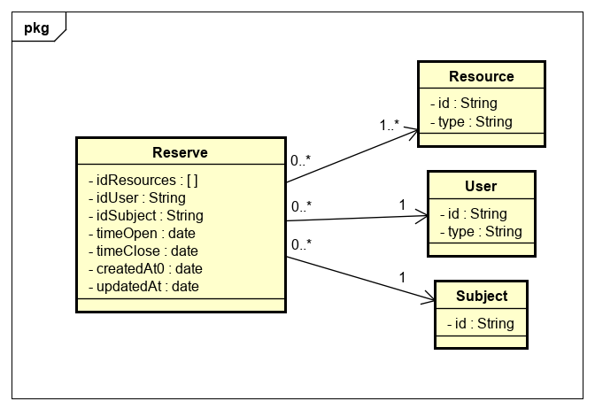
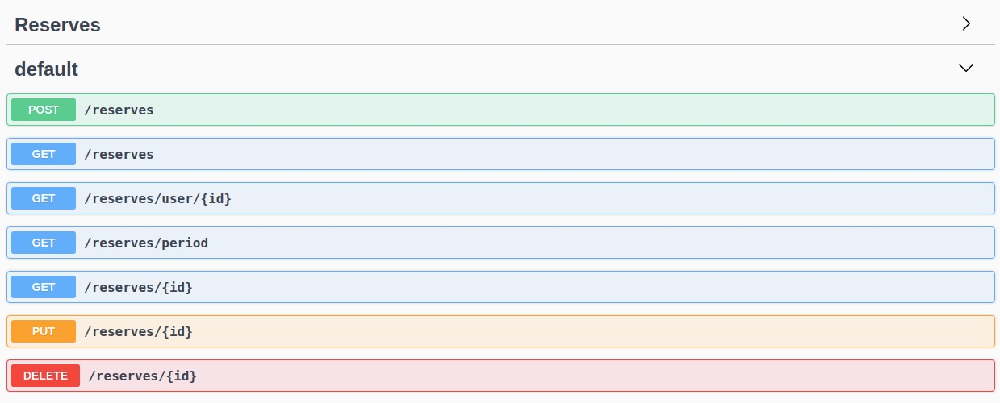

## Construção de Software - Grupo 2

URL - Keycloak Amazon
http://3.16.255.145:8080/auth/

Caso de teste
POST - http://3.16.255.145:3456/login

Body: 
{
	"login": "user",
	"password": "Senha@123"
}


- Para fazer rodar essa joça sem ssl, rode o seguinte comando:
```sh
$ docker exec -it constr-sw-2020-1-grupo2_keycloak_1 bash

$ cd opt/jboss/keycloak/bin

$ ./kcadm.sh config credentials --server http://localhost:8080/auth 
--realm master --user usr-admin --password

$ ./kcadm.sh update realms/master -s sslRequired=NONE
```

- Após configurar um novo realm, execute novamente o último comando citado acima.
```sh
$ docker exec -it constr-sw-2020-1-grupo2_keycloak_1 bash

$ cd opt/jboss/keycloak/bin

$ ./kcadm.sh update realms/newrealm -s sslRequired=NONE
```

#### Arquivo Swagger

[swagger.yaml](uploads/0d22917a6147b59437809f691f2768ed/swagger.yaml)

#### Modelagem do CRUD de Reservas



### Frameworks utilizados

#### Nest
Nest é um framework tipado que combina elementos de programação orientada a objetos, programaçao funcional, e programação reativa. Ele é utilizado em cima do express, tem possiblidade de ser trabalhado com typescript, e é bom para construir CRUD.

#### MongoDB e Mongoose

Utilizamos MongoDB, e como complemento escolhermos usar o Mongoose, que é uma biblioteca que faz a relação do banco de dados com a aplicação desenvolvida.

#### Swagger

O Swagger é uma biblioteca para realizar a documentação das rotas da aplicação.



As rotas podem ser encontradas em:

http://localhost:3457/api/